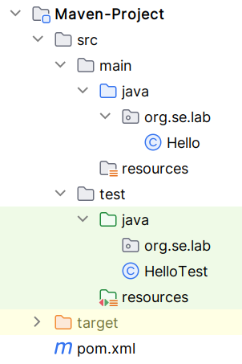
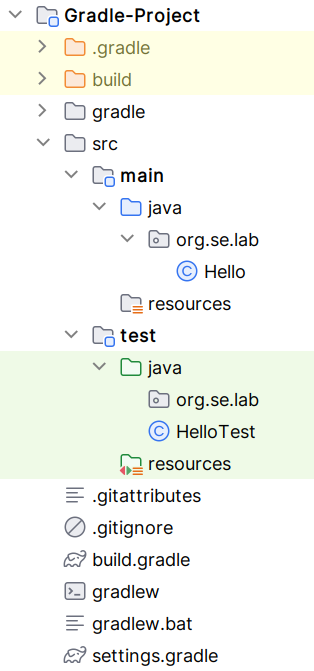
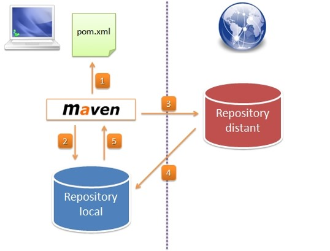
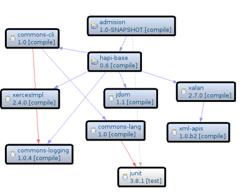
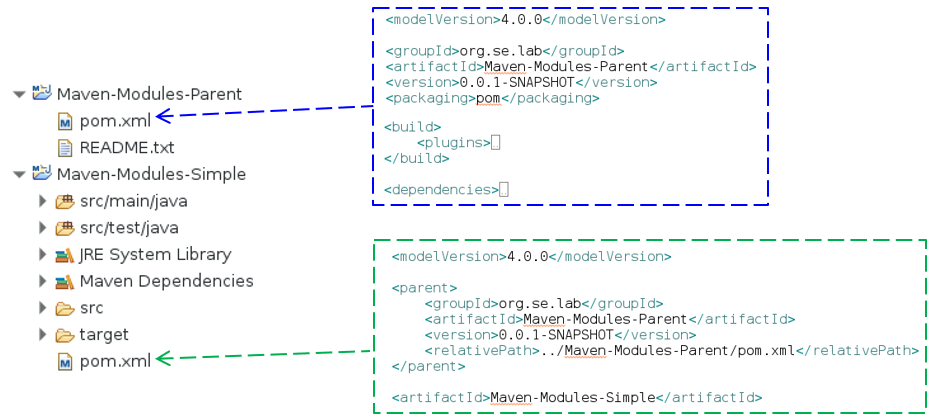
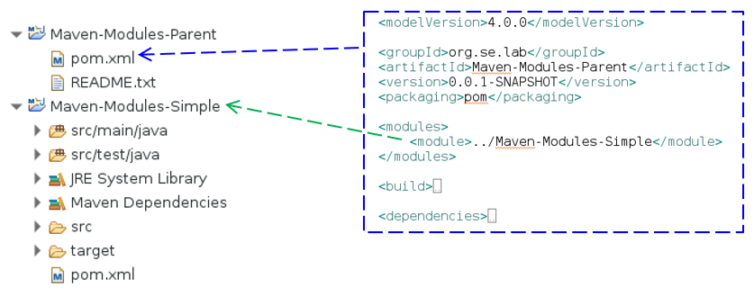

# Building Java Projects 

Explicit build tools in Java projects simplify and automate the build process, 
manage dependencies efficiently, ensure consistency across environments, and 
integrate with the broader ecosystem of development, testing, and deployment 
tools. 

This automation and management capability is essential for modern software 
development practices, enabling developers to focus more on writing code and 
less on the mechanics of building and managing their projects.


## Project Layout 

Maven and Gradle both follow the convention over configuration principle and have 
similar default directory structures. 



* **src/main/java**: Application/Library source code
* **src/main/resources**: Application/Library resources (configuration files, etc.)
* **src/test/java**: Test source code
* **src/test/resources**: Test resources

* Maven uses an XML file **pom.xml** for build configuration.

* Maven uses the **target** directory as the default build folder. 
    This is where Maven stores all its outputs including compiled classes, 
    processed resources, and the final packaged artifact (e.g., JAR, WAR).



* Gradle uses a Groovy-based DSL (or Kotlin for Kotlin DSL) for configuration, 
    which is defined in a **build.gradle** (or **build.gradle.kts** for Kotlin DSL) file.

* Gradle uses the **build** directory as the default build folder. Similar to Maven's 
    `target`, Gradle's build directory contains compiled classes, processed resources, 
    and the final packaged artifacts.


## Maven 

Apache Maven is a software project management and comprehension tool. 

Based on the concept of a **project object model (POM)**, Maven can manage a project's 
build, reporting and documentation from a central piece of information.

### Setup

Installing Maven is simple: 
* Download and unzip [apache-maven-3.x.y-bin.zip](https://maven.apache.org/download.cgi)
* Set **M2_HOME** environment variable
* Update the **PATH** environment variable to include Maven's `bin/`` folder.

```
$ mvn -version
Apache Maven 3.9.4 (dfbb324ad4a7c8fb0bf182e6d91b0ae20e3d2dd9)
Maven home: /opt/apache-maven-3.9.4
Java version: 17, vendor: Oracle Corporation, runtime: /opt/java/jdk-17
Default locale: en_US, platform encoding: UTF-8
OS name: "linux", version: "6.1.0-11-amd64", arch: "amd64", family: "unix"
```

### Project Object Model (POM)

The POM is the basic unit of work in Maven:

```XML
<project xmlns="http://maven.apache.org/POM/4.0.0" xmlns:xsi="http://www.w3.org/2001/XMLSchema-instance"
	xsi:schemaLocation="http://maven.apache.org/POM/4.0.0 http://maven.apache.org/xsd/maven-4.0.0.xsd">
	<modelVersion>4.0.0</modelVersion>

	<groupId>org.se.lab</groupId>
	<artifactId>Maven-Project</artifactId>
	<version>0.0.1-SNAPSHOT</version>
	<packaging>jar</packaging>

	<properties>
		<project.build.sourceEncoding>UTF-8</project.build.sourceEncoding>
	</properties>

</project>
```

* **project**: This is the top-level element in all Maven `pom.xml` files.
* **modelVersion**: This element indicates what version of the object model this POM is using.

* **groupId**: This element indicates the unique identifier of the organization or group 
    that created the project. 
* **artifactId**: This element indicates the unique base name of the primary artifact being 
    generated by this project.
* **version**: This element indicates the version of the artifact generated by the project.
* **packaging**: This element indicates the package type to be used by this artifact 
    (e.g. JAR, WAR, EAR, etc.).

* **properties**: This element is used to set some global values like encodings or version 
    numbers.

Whenever we want to customize the build for a Maven project, this is done by adding or 
reconfiguring **plugins**:

```XML
	<build>
		<plugins>
			<plugin>
				<groupId>org.apache.maven.plugins</groupId>
				<artifactId>maven-compiler-plugin</artifactId>
				<version>3.8.0</version>
				<configuration>
					<release>17</release>
				</configuration>
			</plugin>
		</plugins>
	</build>
```

The **dependencies** section of the `pom.xml` lists all of the external dependencies 
that our project needs in order to build (whether it needs that dependency at compile 
time, test time, run time, or whatever).

```XML
	<dependencies>
		<dependency>
			<groupId>junit</groupId>
			<artifactId>junit</artifactId>
			<version>4.13.2</version>
			<scope>test</scope>
		</dependency>
	</dependencies>
```

For each external dependency, you'll need to define at least four things: **groupId**, 
**artifactId**, **version**, and **scope**. 

The `groupId`, `artifactId`, and `version` are the same as those given in the `pom.xml` 
for the project that built that dependency. 

The `scope` element indicates how your project uses that dependency, and can be values 
like **compile**, **test**, and **runtime**.

Maven looks in your local repository (`~/.m2/repository` is the default location) to find 
all dependencies.
Whenever a project references a dependency that isn't available in the local repository, 
**Maven will download the dependency** from a remote repository into the local repository.




**Transitive dependencies** are the dependencies of the libraries that your project directly 
depends on. When you add a dependency to your project's `pom.xml` file, Maven automatically 
resolves and includes not just that dependency but also its dependencies (and so on) into 
your project. 



This feature simplifies dependency management by ensuring that all necessary libraries are 
available without needing to explicitly list each one.

_Example_: Show all dependencies of a given Maven project
```
$ mvn dependency:tree

[INFO] Scanning for projects...
[INFO] 
[INFO] ----------------------< org.se.lab:Maven-Project >----------------------
[INFO] Building Maven-Project 0.0.1-SNAPSHOT
[INFO]   from pom.xml
[INFO] --------------------------------[ jar ]---------------------------------
[INFO] 
[INFO] --- dependency:3.6.0:tree (default-cli) @ Maven-Project ---
[INFO] org.se.lab:Maven-Project:jar:0.0.1-SNAPSHOT
[INFO] \- junit:junit:jar:4.13.2:test
[INFO]    \- org.hamcrest:hamcrest-core:jar:1.3:test
[INFO] ------------------------------------------------------------------------
[INFO] BUILD SUCCESS
[INFO] ------------------------------------------------------------------------
```

### Build Lifecycle

Default lifecycle Build phases:

* **validate**: Validate the project is correct and all necessary information is available
* **compile**: Compile the source code of the project.
* **test**: Test the compiled source code using a suitable unit testing framework. 
    These tests should not require the code be packaged or deployed.
* **package**: Take the compiled code and package it in its distributable format, such as a JAR.
* **integration-test**: Process and deploy the package if necessary into an environment where
     integration tests can be run.
* **verify**: Run any checks to verify the package is valid and meets quality criteria.
* **install**: Install the package into the local repository, for use as a dependency in 
    other projects locally.
* **deploy**: Done in an integration or release environment, copies the final package to the 
    remote repository for sharing with other developers and projects.

### POM Inheritance
Elements in a POM which can be merged from a **parent POM** include the following:
* Dependencies
* Plugin lists
* Plugin configuration
* Resources

We can introduce our own parent POMs by specifying the parent element in the POM.




### POM Aggregation
Instead of specifying the parent POM from the module, aggregation 
**specifies the modules from the parent POM**.

The parent project now knows its modules.




If a Maven command is invoked against the parent project, that Maven command will 
then be executed to the parent's modules as well.


## Gradle

Maven's structured and straightforward approach is suitable for many traditional 
Java projects, while Gradle offers more flexibility and performance optimizations 
for large-scale or complex projects.

* Gradle uses a **Groovy-based Domain Specific Language (DSL)** for its build 
    scripts `build.gradle`, making the scripts more concise and expressive. 
    **Kotlin DSL** `build.gradle.kts` is also supported for those preferring Kotlin.

* Gradle is known for its **superior performance**, especially in large projects. 
    It features incremental builds and a build cache, significantly reducing build 
    times by reusing outputs from previous builds.

* Gradle offers a more **flexible dependency management** system that can resolve 
    conflicts more intelligently. It supports dynamic versions and dependency 
    substitution, providing more control over how dependencies are resolved.

* Gradle is **highly extensible** through plugins and custom tasks. The use of 
    **Groovy** or **Kotlin** for configuration scripts allows developers to 
    write custom logic directly in the build scripts, offering a higher degree 
    of customization.

* Gradle provides a more **flexible task-based model**. Any task can depend on 
    other tasks, creating a graph of task dependencies. This model offers more 
    control over the build process and can accommodate a wide range of project 
    types and workflows.

* Gradle has gained significant popularity, especially in the Android development 
    community (being the **official build tool for Android**). 
    The ecosystem is vibrant and growing, with comprehensive documentation and 
    community support.

* The flexibility and power of Gradle come with a **steeper learning curve**. 
    Understanding Gradle's task-based model and Groovy or Kotlin scripting can 
    take more time.

### Setup

Installing Gradle: 
* Download and unzip [gradle-7.x.y-bin.zip](https://gradle.org/releases/)
* Update the **PATH** environment variable to include Gradle's `bin/` folder.

```
$ gradle -version

------------------------------------------------------------
Gradle 7.6.4
------------------------------------------------------------

Build time:   2024-02-05 14:29:18 UTC
Revision:     e0bb3fc8cefad8432c9033cdfb12dc14facc9dd9

Kotlin:       1.7.10
Groovy:       3.0.13
Ant:          Apache Ant(TM) version 1.10.13 compiled on January 4 2023
JVM:          17 (Oracle Corporation 17+35-2724)
OS:           Linux 6.1.0-11-amd64 amd64

```

_Example_: Generate a Gradle project sekelton 
```
$ gradle init

$ tree
├── build
├── build.gradle
├── gradle
│   └── wrapper
│       ├── gradle-wrapper.jar
│       └── gradle-wrapper.properties
├── gradlew
├── gradlew.bat
├── settings.gradle
└── src
    ├── main
    │   ├── java
    │   └── resources
    └── test
        ├── java
        └── resources
```

The **gradlew** file is part of the **Gradle Wrapper**, a key feature of Gradle 
that addresses the problem of ensuring a project can be built with a specific 
version of Gradle without requiring all developers and the build environment 
to manually install and maintain that version.


### Gradle Domain-Specific Language (DSL)

The `build.gradle` file is at the heart of configuring projects using Gradle. 
This file is written using **Groovy-based Domain-Specific Language (DSL)** 
or **Kotlin DSL** `build.gradle.kts`, allowing for scripting as well as configuration.

_Example_: `build.gradle` using the Groovy DSL

```Groovy
plugins {
    id 'java'
}

group = 'org.se.lab'
version = '0.0.1-SNAPSHOT'

java {
    sourceCompatibility = '17'
}

repositories {
    mavenCentral()
}

dependencies {
    testImplementation 'junit:junit:4.13.2'
}

tasks.withType(JavaCompile) {
    options.encoding = 'UTF-8'
}
```

* **plugins**: This section declares the plugins to be applied to the project.
    The java plugin is applied, which adds Java compilation, testing, and packaging 
    capabilities to the project. It's essential for any Java project as it sets up 
    the project layout and tasks for Java development.

* **group** and **version**:  Defines the Maven group ID and version of the project. 
    These properties are used when publishing the project's artifacts to a repository.
    The `group` specifies the group ID which is often used to structure packages and 
    manage releases. The `version` specifies the project's version, with 
    `0.0.1-SNAPSHOT` indicating a project in a development state.

* **java**: THis Java plugin extension configures options specific to the Java plugin.
    `sourceCompatibility` is set to `17`, indicating that the project uses 
    Java 17 features and syntax. This ensures compatibility and proper compilation 
    with the specified Java version.

* **repositories**: Specifies the repositories from which dependencies should be retrieved.
    `mavenCentral()` indicates that Maven Central Repository is used as the source 
    for dependencies. It's one of the most common and extensive public repositories for 
    Java libraries.

* **dependencies**: Declares project dependencies, specifying libraries required to compile, 
    test, and run the project.
    This block includes a single dependency on JUnit version 4.13.2, used for testing purposes.

* **Tasks Configuration**: Customizes tasks of a specific type, in this case, Java compilation 
    tasks.
    Sets the encoding for Java compilation to 'UTF-8'. This ensures that source files are 
    interpreted as UTF-8 encoded, which is important for projects including source files with 
    characters outside the ASCII range.

_Example_: `build.gradle.kts` using the Kotlin DSL

```Kotlin
plugins {
    java
}

group = "org.se.lab"
version = "0.0.1-SNAPSHOT"

java {
    sourceCompatibility = JavaVersion.VERSION_17
}


repositories {
    mavenCentral()
}

dependencies {
    testImplementation("junit:junit:4.13.2")
}

tasks.withType<JavaCompile> {
    options.encoding = "UTF-8"
}
```

Based on Kotlin, a **statically typed language** that runs on the JVM. Kotlin DSL 
offers more verbose syntax compared to Groovy but **provides better safety, 
performance, and tooling support** due to Kotlin's static typing. 

Kotlin DSL scripts are **.gradle.kts** files, and they offer superior auto-completion, 
error detection, and refactoring support in IDEs.

Kotlin DSL is better suited for **large, complex projects** where build script 
correctness and maintainability are critical. It's the preferred choice for projects 
already using Kotlin or teams that value the static typing and tooling support Kotlin 
offers.


## References

* Maven 
    * [Apache Maven](http://maven.apache.org/index.html)
    * Prabath Siriwardena. **Mastering Apache Maven 3**. Packt Publishing, 2014


* Gradle

