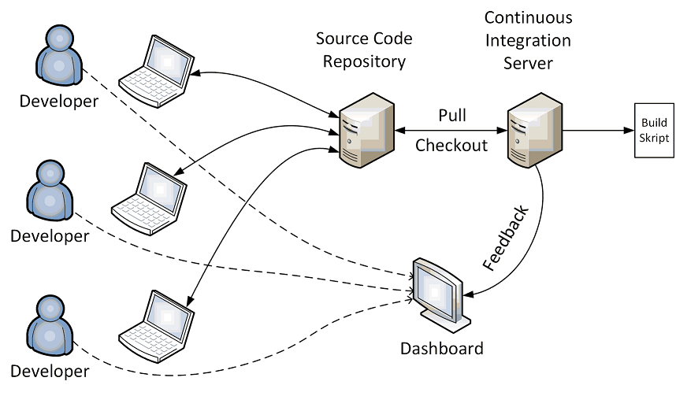

# Continuous Integration

> **Continuous Integration (CI)** is a software development practice where 
> members of a team integrate their work frequently, usually each person 
> integrates at least daily – leading to multiple integrations per day. 
> Each integration is verified by an automated build (including test) to 
> detect integration errors as quickly as possible.

Many teams find that this approach leads to significantly reduced integration 
problems and allows a team to develop cohesive software more rapidly:
1. A developer commits code to the version control repository. 
2. The CI server detects that changes have occurred in the version control 
    repository, so the CI server retrieves the latest copy of the code from 
    the repository and executes a build script. 
3. The CI server generates feedback (HTML reports, emails) for project members.
4. The CI server continues to poll for changes in the version control repository.

## Benefits of Continuous Integration

* The greatest and most wide-ranging benefit of Continuous Integration 
    is **reduced risk**.
    At all times **you know where you are**, what works, what doesn't, the 
    outstanding bugs you have in your system.

* Continuous Integrations doesn't get rid of **bugs**, but it does make them 
    dramatically **easier to find and remove**.
    As a result, projects with Continuous Integration tend to have dramatically 
    less bugs, both in production and in process.

* If you have continuous integration, it removes one of the biggest barriers 
    to **frequent deployment**.

## Roadmap to Continuous Integration

1. Get everything you need into **source control**.
2. Get the **build automated**. 
3. Introduce some **automated testing** into you build.
4. Try to **speed up** the commit build. 

If you are starting a new project, **begin with Continuous Integration from the beginning**. 

## References

* [Martin Fowler: Continuous Integration](https://www.martinfowler.com/articles/continuousIntegration.html)

* Paul M. Duvall , Steve Matyas, et al. **Continuous Integration**: Improving Software Quality and Reducing Risk. Addison-Wesley, 2007

* Jez Humble und David Farley. **Continuous Delivery: Reliable Software Releases through Build, Test, and Deployment Automation**. Addison-Wesley, 2010

* Dave Farley. **Continuous Delivery Pipelines: How To Build Better Software Faster**. Independently published, 2021

*Egon Teiniker, 2024, GPL v3.0*