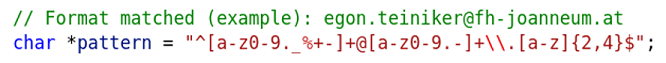
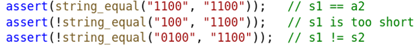
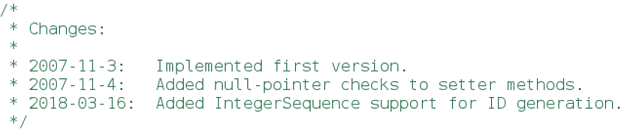
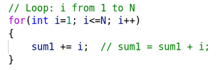
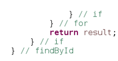

# Source Code Documentation

## Introduction 

Nothing can be so **helpful** as a **well-placed comment**.

Nothing can **clutter up a source code** than frivolous **dogmatic comments**.

Nothing can be so **damaging** as an **old comment** that propagates lies and misinformation.

> Don’t comment bad code – rewrite it.

The **older** a comment is, and the **farther away** it is from the code it describes, 
the more likely it is to be just wrong.
**Code changes and evolves**. Chunks of it move from here to there. 
Unfortunately, the **comments don’t always follow** them.

All too often the **comments get separated from the code** they describe and become 
isolated fragments of decreasing accuracy.

> Truth can only be found in one place: the code  

One of the **common motivations for writing comments** is **bad code**.
When we write source code, and we know it is confusing and disorganized – 
we start to comment it.

**Clear and expressive code** with **few comments** is far superior to cluttered and complex code with lots of comments.

Rather than spend time writing a comment that explain the mess, we should **clean up the source code**. 

## Comments in Education

> University is a really good place to learn really bad code commenting techniques.

There are two major factors: 
* Unlike in real world, you do a lot of **small projects** as a **solo developer**.
* That commenting style you are emulating from your textbook is only a good practice when the comments are intended for a student learning program. 
It is **annoying to professional programmers**. 

## Good Comments

* **Explanation of Intent**\
    Comments provide the intent behind a decision.
    
    _Example_:The comment lets us know what the regular expression is intended 
    to match – in this case an email address.
    
    

* **Clarification**\
    Sometimes it is helpful to translate the meaning of some obscure argument or 
    return value into something that’s readable.

    _Example_:

    

* **TODO Comments**\
    It is sometimes reasonable to leave “to do” notes. 
    TODOs are **jobs that the programmer thinks should be done**, 
    but for some reason can’t do at the moment.
    Scan through your code regularly and **eliminate the ones you can**.

* **Legal Comments**\
    Sometimes our corporate coding standards force us to write certain comments for legal reasons.
    For example, **copyright** and **authorship statements** are necessary things to put into a comment at the start of each source file.

## Bad Comments 

* **Commented-Out Code**\
    Few practices are as hateful as commenting-out code.
    Don’t do this - **use a source code control system!**

    Others who see that commented-out code will not have the courage to delete it…

* **Journal Comments**\
    Sometimes people add a comment to the start of a module every time they edit it - 
    as a kind of journal or log. 

    

    We have **source code control systems** for that!

* **Redundant Comments**\
    Don’t repeat the code in your comments.

    

    This comment is not more informative that the code!

* **Closing Brace Comments**\
    Sometimes programmers will put special comments on closing braces.

    

    If you find yourself wanting to mark your closing braces, **try to shorten 
    your methods instead**.

## References

* Robert C. Martin. **Clean Code - A Handbook of Agile Software Craftsmanship**. Prentice Hall, 2008

*Egon Teiniker, 2024, GPL v3.0*