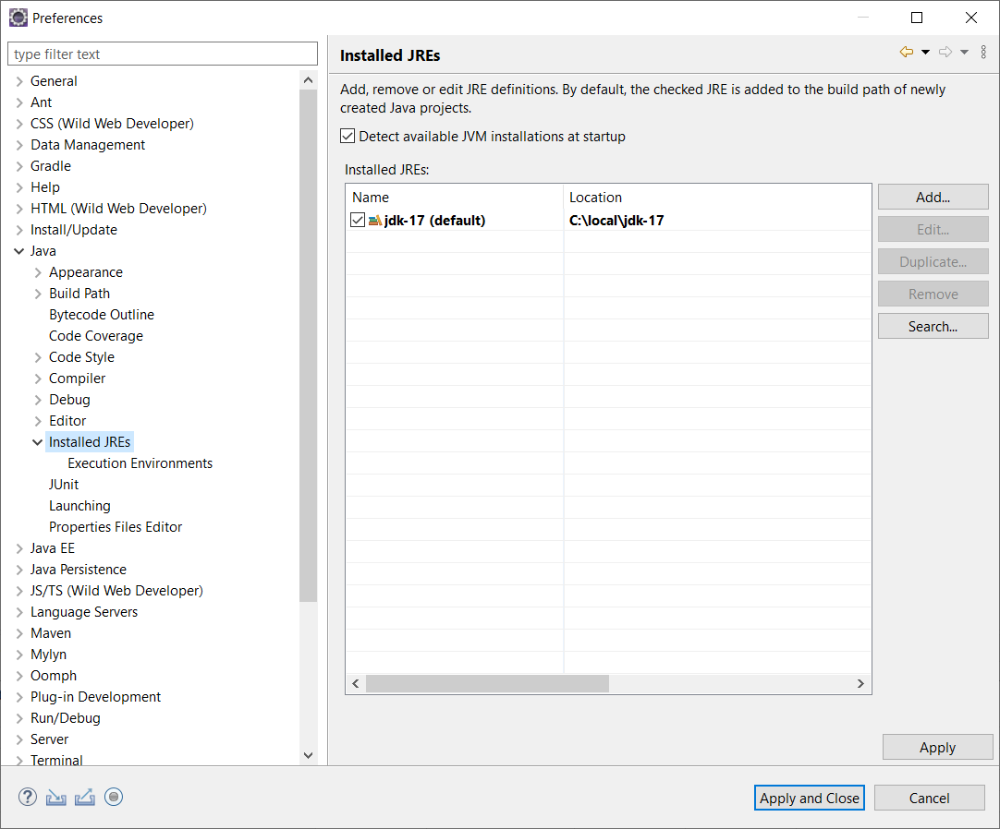

# Eclipse 

Eclipse is a widely used integrated development environment (IDE) primarily 
for Java programming, although it also supports various other programming 
languages through plugins. 

It was originally developed by IBM and is now managed by the Eclipse Foundation. 

Here are some key features of Eclipse:

* **Java Development**: Eclipse provides comprehensive support for Java development, 
    including a powerful code editor, built-in compiler, debugger, and syntax 
    highlighting. It also offers advanced features like code suggestions, refactoring 
    tools, and error detection.

* **Extensible Plugin Architecture**: Eclipse is famous for its plugin architecture, 
    which allows it to be extended with various add-ons for different programming 
    languages and tools. 
    This makes it highly customizable and adaptable to different development needs.

* **Support for Other Languages**: Through plugins, Eclipse can be used for programming 
    in C++, Python, PHP, Ruby, and many other languages.

Eclipse is available in several different editions, each tailored to specific development 
needs. These are known as **Eclipse Packages** and are pre-configured with a set of plugins 
and tools to suit particular types of development. Here are some of the key editions of Eclipse:

* **Eclipse IDE for Java Developers**: This package contains tools for Java developers, 
    including the Java development tools (JDT) for Java and Plug-in Development Environment 
    (PDE). It's suitable for those primarily focused on Java development.

* **Eclipse IDE for Java EE Developers**: Geared towards developers working on Java Enterprise 
    Edition (Java EE) applications, this package includes tools for Java EE, web, JavaScript, 
    and XML development. It’s beneficial for creating enterprise-level applications.

* **Eclipse IDE for C/C++ Developers (CDT)**: This edition is specifically for developers working 
    with C and C++. It includes the C/C++ Development Tooling (CDT) and is often used for developing.

* **Eclipse IDE for PHP Developers**
* **Eclipse IDE for JavaScript and Web Developers**
* Many more...

## Common Settings

Before we can start working with Eclipse, a few important settings must be made.
We can find the settings in the **[Window|Preferences]** menu.

* `[General|Workspace]`: Text file encoding | Other: UTF-8

* `[General|Network Connections]`: If we work in a network of an organisation and need some proxy configurations.

* `[Java|Code Style|Formatter]`: We can eiter configure all formats manually or import them from an XML file.

* `[Java|Installed JREs]`: Here we configure the installed JDK we want to use. 

## Shortcuts 

Eclipse IDE offers a vast array of keyboard shortcuts to enhance productivity and 
make development tasks more efficient. 

Here are some of the most commonly used shortcuts in Eclipse for various common tasks:
* `Ctrl + Space`: Activates content assist, which provides suggestions for completing 
    the current statement.

* `Ctrl + 1`: Opens the quick fix and context-sensitive suggestions menu. It's very 
    useful for fixing coding errors quickly or for refactoring suggestions.

* `Ctrl + Shift + O`: Organizes imports; adds missing import statements and removes 
    unused ones.

* `Ctrl + F11`: Runs the application. If you have multiple run configurations, 
    it runs the most recent configuration.

* `F11`: Debugs the application using the last used debug configuration.

* `Ctrl + Shift + F`: Formats the selected code or entire file if nothing is selected 
    according to the code formatter preferences.

* `Ctrl + D`: Deletes the current line or selected lines without needing to select 
    the entire line(s).

* `Ctrl + /`: Toggles commenting out the selected lines or the current line if no 
    selection is made.

* `Ctrl + Z`: Undo the last action.

* `Ctrl + Y`: Redo the last undone action.

* `Ctrl + S`: Saves the current file.

* `Ctrl + Shift + T`: Opens the 'Open Type' dialog to find and open a class file by name.

* `Alt + Up Arrow`: Moves the selected line or lines of code upward.
* `Alt + Down Arrow`: Moves the selected line or lines of code downward.

* `Alt + Left Arrow / Alt + Right Arrow`: Navigates backward and forward through 
    the history of visited code locations.

## Tutorials 

* [YouTube: 30+ Eclipse Shortcuts Every Java Programmer Should Know](https://youtu.be/LIGkIGdmHII?si=mWcGDVty7kFQBktO)
* [YouTube: How To Debug Java Code The Right Way - Eclipse Debugger Full Tutorial](https://youtu.be/aqcJsKdjjvU?si=Q5YN0pLytfGQN-zE)

## References

* [Eclipse IDE Packages](https://www.eclipse.org/downloads/packages/)

*Egon Teiniker, 2024, GPL v3.0*