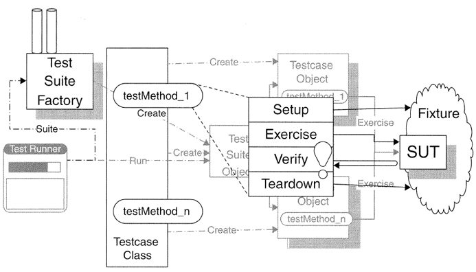
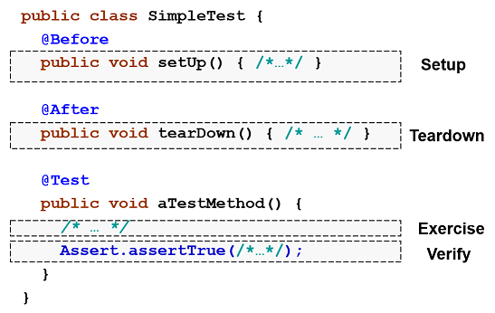

# Test Automation

A **unit test** is a piece of code that exercises a very small, 
specific area of functionality of code being tested.

* Unit tests are **written by programmers**.
* Unit tests are performed to prove that a piece of code does what the developer 
    thinks it should do.
* Unit tests make our designs better and reduce the amount of time we spend for 
    debugging.
* Unit tests behave as **executable documentation**.

## Four-Phases of a Test

Each test is represented by a test method that implements a single 
four-phase procedure:

* **Setup**: We set up the test fixture that is required for the SUT to exhibit the 
    expected behavior as well as anything we need to put in place to be able to 
    observe the actual outcome.

* **Exercise**: We interact with the SUT.

* **Verify**: We do whatever is necessary to determine whether the expected 
outcome has been obtained.

* **Teardown**: We tear down the test fixture to put the world back into the 
    state in which we found it.

## xUnit Frameworks

All members of the xUnit framework family implement a basic set of features.

_Figure: xUnit Framework (Meszaros, 2007)_

The individual parts of the test setting are:

* **System under Test (SUT)**: Whatever thing we are testing. The SUT is 
always defined from the perspective of the test. When we are writing unit 
tests, the SUT is whatever class, object, or method we are testing.

* **Depended-on Component (DOC)**: An individual class or a large-grained 
component on which the SUT depends. The dependency is usually one of 
delegation via method calls.

* **Test Fixture**: The test fixture is everything we need to have in place 
to exercise the SUT. It includes at least an instance of the SUT. 
It also may include some DOC instances.

* **Test Suite**: We define a composite test case called test suite to hold 
a collection of individual test cases to execute. Test suites (or suites of 
suites) allow to run all test cases with a single command.

* **Test Runner**: Tests are run by using a test runner which 
constructs a test suite containing all of the test methods in the test case 
class.

* **Test Results**: Test results are classified into one of three categories:
    * A test is considered to have **failed** when an assertion fails.
    * A test is considered to have an **error** when either the SUT or the 
    test itself fails in an unexpected way.
    * When a test runs without any error of failures, it is considered to be 
    **successful**.
    
	For each test error or test failure, xUnit records information that can be examined to help understand exactly what went wrong.

## JUnit 4 Tutorial

JUnit is a simple Java framework to write repeatable tests.

JUnit Tests classes are **annotated Java classes** without special base classes.
Test cases are implemented as **annotated methods**.

### Annotations
Since JUnit4, Java annotations are used to mark test, setup and tear down methods.

* **@Before**: Annotating a public void method with @Before causes that method 
to be run before the Test method. 
The @Before methods of superclasses will be run before those of the current class, 
unless they are overridden in the current class. 
No other ordering is defined.

* **@BeforeClass**: Annotating a public static void no-arg method with @BeforeClass 
causes it to be run once before any of the test methods in the class. 
The @BeforeClass methods of superclasses will be run before those of the current 
class, unless they are shadowed in the current class.

* **@After**: If you allocate external resources in a Before method you need to 
release them after the test runs. Annotating a public void method with @After causes 
that method to be run after the Test method. 
All @After methods are guaranteed to run even if a Before or Test method throws an 
exception. 
The @After methods declared in superclasses will be run after those of the current 
class, unless they are overridden in the current class.

* **@AfterClass**: If you allocate expensive external resources in a BeforeClass 
method you need to release them after all the tests in the class have run. 
Annotating a public static void method with @AfterClass causes that method to be 
run after all the tests in the class have been run. 
All @AfterClass methods are guaranteed to run even if a BeforeClass method throws 
an exception. 
The @AfterClass methods declared in superclasses will be run after those of the 
current class, unless they are shadowed in the current class.

* **@Test**: The Test annotation tells JUnit that the public void method to 
which it is attached can be run as a test case. 
To run the method, JUnit first constructs a fresh instance of the class then 
invokes the annotated method. 
Any exceptions thrown by the test will be reported by JUnit as a failure. 
If no exceptions are thrown, the test is assumed to have succeeded.

  
* **@Test(expected = Exception.class)**: The optional annotation parameter **expected** declares 
that a test method should throw an exception.
If it doesn't throw an exception or if it throws a different exception than the one 
declared, the test fails.

* **@Test(timeout = 1000)**: The optional annotation parameter **timeout** causes 
a test to fail if it takes longer than a specified amount of clock time (measured in 
milliseconds).

* **@Ignore**: Sometimes you want to temporarily disable a test or a group of tests. 
Methods annotated with Test that are also annotated with @Ignore will not be executed 
as tests. 
Also, you can annotate a class containing test methods with @Ignore and none of the 
containing tests will be executed.

* **@RunWith(Suite.class)**: When a class is annotated with @RunWith or extends a class 
annotated with @RunWith, JUnit will invoke the class it references to run the tests 
in that class instead of the runner built into JUnit.
Suites in JUnit 4 are built using RunWith, and a custom runner named Suite

* **@Suite**: Using Suite as a runner allows you to manually build a suite containing 
tests from many classes. 

### Assert Methods
JUnit assert methods are helper methods which determine whether a method under test is 
performing correctly or not. 
They let us assert that some condition is true.  Only failed assertions are recorded.

* **Assert.assertTrue(boolean condition)**:
    Asserts that a condition is true.

* **Assert.assertFalse(boolean condition)**:
     Asserts that a condition is false.

* **Assert.fail(String message)**:
     Fails a test with the given message.
     
* **Assert.assertNull(Object object)**: 
      Asserts that an object is null.

* **Assert.assertNotNull(Object object)**:
    Asserts that an object isn't null.

* **Assert.assertEquals(Object expected, Object actual)**:
     Asserts that two objects are equal.

* **Assert.assertSame(Object expected, Object actual)**:
    Asserts that two objects refer to the same object. 

* **Assert.assertArrayEquals(Object[] exp, Object[] act)**:
    Asserts that two object arrays are equal.
    

## References

* Gerard Meszaros. **xUnit Test Patterns**. Addison-Wesley, 2007 
* [xUnit Test Patterns Web Page](http://xunitpatterns.com/)
* [JUnit](https://junit.org/junit4/)

*Egon Teiniker, 2024, GPL v3.0*
