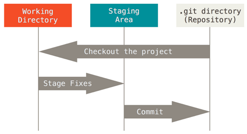
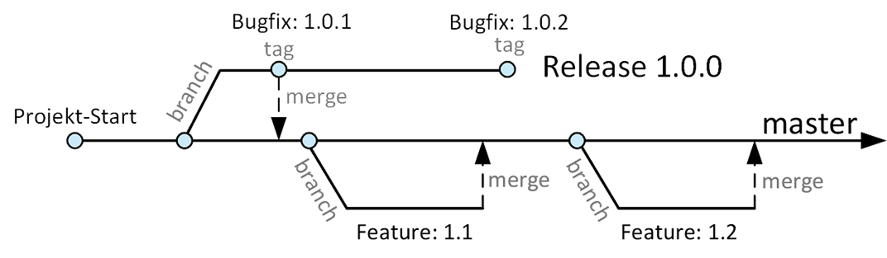

# Source Code Versioning

The Linux kernel is an open-source software project of fairly large scope.

In 2002, the Linux kernel project began using a proprietary DVCS called BitKeeper.
In 2005, the relationship between the community that developed the Linux kernel 
and the commercial company that developed BitKeeper broke down.

This prompted the Linux development community to develop their own tool...

## Git

**Most operations in Git only need local files and resources to operate** – generally 
no information is needed from another computer on a network.
This means that there is very little we can not do if we are offline.

**Everything in Git is check-summed** before it is stored and is then referred 
to by that checksum. This means it’s impossible to change the contents of 
any file or directory without Git knowing about it.

The mechanism that Git uses for this checksumming is called a **SHA-1 hash**. 
This is a 40-character string composed of hexadecimal characters (0–9 and a–f) 
and calculated based on the contents of a file or directory structure in Git.

_Example_: `24b9da6552252987aa493b52f8696cd6d3b00373`

### Three States

Git has **three main states for files**: 
* **Modified** means that we have changed the file but have not committed it to 
    your database yet. 
* **Staged** means that we have marked a modified file in its current version to 
    go into your next commit snapshot.
* **Committed** means that the data is safely stored in our local database. 

Git has **three main sections of a project**: 
* The **.git directory** is where Git stores the metadata and object database for 
    our project. This is what is copied when we clone a repository from another computer.

* The **working directory** is a single checkout of one version of the project. 
    These files are pulled out of the compressed database in the Git directory 
    and placed on disk for us to use or modify.

* The **staging area** is a file that stores information about what will go into 
    our next commit. It’s sometimes referred to as the **index**.

The **basic Git workflow** is like:
1. We **modify** files in our working directory.

2. We **stage** the files, adding snapshots of them to your staging area.

3. We do a **commit**, which takes the files as they are in the staging area and stores that snapshot permanently to our Git directory.

Each file in your working directory can be in one of two states: 
* **Tracked files** are files that were in the last snapshot. 
    They can be unmodified, modified, or staged. 
* **Untracked files** are everything else – any files in our working directory 
    that were not in our last snapshot and are not in our staging area.

When we first clone a repository, all of our files will be tracked and unmodified because 
Git just checked them out and we haven’t edited anything.

As we edit files, Git sees them as modified, because we have changed them since our last commit. 

We stage these modified files and then commit all our staged changes, and the cycle repeats.

The following examples present common scenarios that can occur when dealing with git.

We start our experiments with a **local repository**:

* [Git Setup](doc/GitSetup.md)
* [Create a local git repository and add files](doc/CreateGitRepositoryAndAddFiles.md)
* [Modify files in a git project](doc/ModifyProjectFiles.md)
* [Explore the commit history](doc/ExploreCommitHistory.md)
* [Rename files in a git project](doc/RenameProjectFiles.md)
* [Remove files from a git project](doc/RemoveProjectFiles.md)

### Tagging

Git has the ability to tag specific points in history as being important. Typically, 
people use this functionality to mark release points.

Git uses two main types of tags:
* A **lightweight tag** is very much like a branch that doesn’t change – it’s just 
    a pointer to a specific commit.
* **Annotated tags**, however, are stored as full objects in the Git database 
    (checksummed; contain the tagger name, email, and date; have a tagging message).
    It’s generally recommended to create annotated tags so we can have all this information.    

Examples of common scenarios using git:

* [Tagging commits in a local repository](doc/TaggingLocalRepository.md)

### Branching and Merging

Branching means we diverge from the main line of development and continue to do work 
without messing with that main line.

The way Git branches is incredibly lightweight, making branching operations nearly 
instantaneous, and switching back and forth between branches generally just as fast.

**Git encourages workflows that branch and merge often**, even multiple times in a day.

Patterns for branching and merging:

* **Develop on Mainline**: All **developers work on the mainline** (master or trunk), 
    committing code at least once a day. 
    
    To make a **complex change**, like developing new functionality or refactoring parts 
    of the system, branches are not used by default. Instead, changes are planned and 
    implemented as a set of small, incremental steps that do not break existing functionality.
    
    The main advantage of this pattern lies in the **rapid feedback** we get on the effect 
    of every change on the fully integrated application.

* **Branch for Release**: Features are always **developed on mainline**.

    A branch is created when our **code is feature-complete** for a particular release, 
    and we want to start working on a new feature.
    
    Only **fixes** for critical defects are **committed on branches**, and they are 
    **merged into mainline** immediately. When we perform an actual release, this branch 
    is optionally tagged.
    
    It is important that **branches for later releases** should **always be made off mainline**, 
    not of existing release branches.

* **Branch for Feature**: This pattern is designed to make it easier for **large teams** to 
    work simultaneously on features while **keeping mainline in a releasable state**.
    
    Every **feature is developed on a separate branch**. Only after a feature is **accepted 
    by testers**, it is **merged to mainline** to ensure that mainline is always releasable. 
    This pattern is motivated by the desire to **keep the trunk always releasable**.
    
    Distributed version control systems (DVCS) are designed with exactly this pattern in mind 
    and make it easy to merge to and from trunk.

    Prerequisites for this pattern to work:
    * Any changes from mainline must be merged onto every branch on a daily basis.
    * Branches must be short-lived (ideally less than a few days).
    * The number of active branches that exist at any time must be limited to the number of 
        user stories in play.
    * Consider having testers accept features before they are merged.
    * Refactorings must be merged immediately to minimize merge conflicts.

    Keep in mind that this pattern is closely related to one of the most common antipatterns 
    of commercial software development because it is fundamentally **contrary to continuous 
    integration**.
    
    Therefore, we should start with the develop on mainline pattern first.

Examples of common scenarios using git:
* [Branching and merging in a local repository](doc/BranchingLocalRepository.md)

## Git vs. GitHub vs. GitLab

* **Git**: We know Git as an open-source distributed version control system (DVCS). 
    If we install the Git software, we can create local repositories and work with them. 
    Such repositories can also be made **available remotely**.

* **GitHub vs GitLab**: GitLab and GitHub are both **web-based repositories** that help 
    with code management and sharing local file changes with a remote repository. 
    As the files on the internet keep changing from time to time, all the data is 
    stored in a repository to be accessed later. Git development to track the changes 
    in a source code requires both GitHub and GitLab. 

Examples of common scenarios using remote git repositories:

* [Clone a remote repository](doc/CloneRemoteRepository.md)
* [Create GitHub repository](doc/CreateGitHubRepository.md)
* [Two developers work together](doc/TwoDevelopersNoConflicts.md)
* [Two developers work together and create merge conflicts](doc/TwoDevelopersWithMergeConflict.md)

## References:
* [YouTube: Git Tutorial for Beginners: Learn Git in 1 Hour](https://youtu.be/8JJ101D3knE)
* [YouTube: Git Tutorial for Beginners: Command-Line Fundamentals](https://youtu.be/HVsySz-h9r4)
* [Git Client: Downloads](https://git-scm.com/downloads)
* [Git Reference Manual](https://git-scm.com/docs)
* [Pro Git Book](https://git-scm.com/book/en/v2)

* [YouTube (Dave Farley): GOTO 2022 - Git Flow Is A Bad Idea](https://youtu.be/JOr4QeIjyW4)

*Egon Teiniker, 2024, GPL v3.0*
