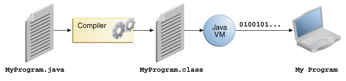

# Java Development Kit (JDK)

The Java Development Kit (JDK) is a software development environment used for 
developing Java applications. It includes the **Java Runtime Environment (JRE)**, 
an **interpreter/loader (Java)**, a **compiler (javac)**, an **archiver (jar)**, a 
**documentation generator (Javadoc)**, and other tools needed for Java development.

## Setup

Installing a JDK is as easy as downloading and unzipping a file.

The `PATH` environment variable must point to the `bin/` folder of the JDK.
In addition, you should set a `JAVA_HOME` environment variable.

### Windows

```
    URL: https://jdk.java.net/java-se-ri/17
    Download: openjdk-17+35_windows-x64_bin.zip
    Unzip and move to: C:\local\jdk-17 
    Set: JAVA_HOME=C:\local\jdk-17
    Add to PATH:  C:\local\jdk-17\bin

    >javac -version
    javac 17
```

### Linux 

```
    URL: https://jdk.java.net/java-se-ri/17
    Download: openjdk-17+35_linux-x64_bin.tar.gz
    $ tar xvzf openjdk-17+35_linux-x64_bin.tar.gz
    $ sudo mkdir /opt/java
    $ sudo mv jdk-17/ /opt/java/

    Set: JAVA_HOME=/opt/java/jdk-17
    Add to PATH: $JAVA_HOME/bin

    $ javac -version
    javac 17
```


### JDK Roadmap 

For product releases after Java SE 8, Oracle will designate only certain
releases as **Long-Term-Support (LTS)** releases. Java SE 8, 11, 17 
and 21 are LTS releases. 
Oracle intends to make future **LTS releases every two years** meaning 
the next planned LTS release is Java 25 in September 2025.

```
Java SE 8 (LTS)		2014 	March	
Java SE 9			2017 	September 	
Java SE 10			2018 	March 		
Java SE 11 (LTS)	2018	September 
Java SE 12 			2019	March 	
Java SE 13 			2019	September
Java SE 14 			2020	March
Java SE 15 			2020	September
Java SE 16 			2021	March
Java SE 17 (LTS)	2021	September
Java SE 18 			2022 	March
Java SE 19 			2022 	September 
Java SE 20			2023 	March 
Java SE 21 (LTS)	2023 	September
Java SE 22          2024    March 
Java SE 23          2024    September 
Java SE 24          2025    March 
Java SE 25 (LTS)    2025    September 
...
```

### OpenJDK vs. Oracle JDK 

OpenJDK is a free and open-source implementation of the Java SE Platform Edition.

Oracle provides long term support for its releases. On the other hand, 
OpenJDK only supports the changes to a release until the next version is released.

**Oracle JDK was licensed under the Oracle Binary Code License Agreement**,
whereas **OpenJDK** has the **GNU General Public License (GNU GPL) version 2** 
with a linking exception.


## Java Programming Language

The Java programming language was originally designed for use in embedded 
consumer-electronic applications by **James Gosling**. Java was first released in **1995**

Java is a general-purpose, concurrent, class-based, **object-oriented programming language**, 
designed to have as few implementation dependencies as possible. 


### Bytecode

Java source code is first written in plain text files ending with the **.java** extension.

Those source files are then compiled into **.class** files by the javac compiler. 
A `.class` file contains **bytecodes**, the machine language of the **Java Virtual Machine (JVM)**. 




### Java Archive File (JAR)

In the context of Java, the concept of a Java Archive (JAR) file is central to packaging, 
distributing, and using Java applications and libraries. JAR is a file format based on 
the popular **ZIP file format**. 

A JAR file contains a **collection of Java classes, metadata, and resources** (such as text, 
images, and configuration files) associated with these classes. It allows developers to 
efficiently distribute their applications or libraries in a single file.

A crucial part of a JAR file is its **manifest file** `MANIFEST.MF`, located in the 
`META-INF` directory. The manifest contains special metadata about the JAR file, such 
as its version, the main class with the `public static void main(String[] args)` method, 
and package sealing and signing information.

_Example_: List the content of a JAR file
```
$ jar tf file.jar
```

To display the content of a JAR file without extracting it, we can use the **jar tool** 
included with the JDK.


## Java Virtual Machine (JVM)

The **java** launcher tool then runs your application with an instance of the Java Virtual Machine.


### Java Class Loaders

With the Java language, the classes generated by the compiler generally remain just as they 
are until they are loading into a JVM. 
Linking classes is part of the job performed by the JVM when it loads them into memory -
**late binding**.

**The runtime system loads classes when they are needed.** 
Each class that gets loaded may have other classes that it depends on, so the loading 
process is recursive.
Once a class is loaded into a JVM, the same class will not be loaded again.

Each class loader also keeps a reference to a parent class loader, defining a 
**tree of class loaders** with the bootstrap loader at the root.

* **Bootstrap class loader**: The bootstrap class loader is used by the JVM to load 
    those Java classes that are necessary for the JVM to function (`java.lang.*` and `java.io.*`). 
* **Extension class loader**: Java 1.2 introduced the standard extension mechanism 
    using the `<JDK>\lib\ext` directory.
    In Java 9 and later the extension mechanism has been removed. 
    This change is part of the **Java Platform Module System (JPMS)** introduced in Java 9.
* **System class loader**: The system class loader locates its classes in those 
    directories and JAR files specified in the **CLASSPATH** environment variable or 
    passed to it via the `-classpath` command line option.
    The system class loader is sometimes called the application class loader.


The JVM knows which class loader to use by utilizing the **delegation model**. 
Whenever a class loader receives a request to load a class, it first asks its parent 
to fulfill the request (it delegates the request to the parent class loader). 
If the parent is successful in loading the class, then the resulting class object is 
returned so that it may be instantiated.

Only if a class loader's parent (and its parent, and so on) fails to load the class 
does the original class loader attempt to load the class.
If the class doesn't exist in the bootstrap class loader's domain, then the extension 
class loader will check the standard extensions location for the class. 
If it's still not found, then the system class loader will check the locations specified 
by the `CLASSPATH` variable for the class. If the class still cannot be located, then a 
`ClassNotFoundException`` will be thrown.

Setting the parameter `-verbose:class` on the Java command line prints a trace of 
the class loading process.


### Just In Time Compiler

The Java compiler `javac` takes the high-level sources and converts them into class files 
used by the JVM. So, the JVM always starts with the bytecode representation of the original 
program.

All code starts out initially running in the interpreter, and once it becomes hot enough it 
gets scheduled for **compilation to native code**. In the **HotSpot VM** this is controlled 
through the use of counters associated with each method.
When a compilation is requested, it is enqueued in a list that is monitored by one or more 
compiler threads. 
If a compiler thread is not busy it removes the compilation request from the queue and begins 
to compile it. 


### Memory Segmentation

The Java virtual machine defines various runtime data areas that are used during execution 
of a program. 


* **Program Counter**: The Java virtual machine can support many threads of execution at once. 
    Each Java virtual machine thread has its own pc (program counter) register.

* **Java Virtual Machine Stacks**: Each Java virtual machine thread has a private Java virtual 
    machine stack, created at the same time as the thread. A Java virtual machine stack stores 
    frames containing the operand stack and local variables.

* **Heap**: The heap is shared among all Java virtual machine threads. The heap is the runtime 
    data area from which memory for all class instances and arrays is allocated.
    
* **Method Area**: The Java virtual machine has a method area that is shared among all Java 
    virtual machine threads containing the bytecode and constant pool. 
    
* **Runtime Constant Pool**: It contains several kinds of constants, ranging from numeric literals 
    known at compile time to method and field references that must be resolved at run time.


### VM Garbage Collectors
The JVM specification dictates that any JVM implementation must include a garbage 
collector to reclaim unused memory.

The HotSpot VM uses a **generational garbage collector** that relies on the following 
two observations, known as the **weak generational hypothesis**:
* Most allocated objects become unreachable quickly.
* Few references from older to younger objects exists.

The HotSpot VM splits the heap into spaces (physical areas) which are referred to as generations:


* **The young generation**: Most newly allocated objects are allocated in the young generation, 
    which is typically small and collected frequently (minor garbage collection).

* **The old generation**: Objects that are longer-lived are eventually promoted to the old 
    generation. This generation is typically larger than the young generation, and its occupancy 
    grows more slowly. 
    Old generation collections (major garbage collection) are infrequent, but when they do occur, 
    they can be quite lengthy. 

A big advantage of the generational garbage collection is that each generation can 
be managed by the garbage collection algorithm most appropriate for its characteristics.


Since Java 8, the **Metaspace** is used to store class metadata required by the Java 
Virtual Machine (JVM). This change was introduced to improve performance and eliminate 
the need for a fixed size memory area.
The Metaspace replaces the PermGen (**Permanent Generation**).

By default, class metadata allocation is only limited by the  amount of available 
native memory. Use the new flag `MaxMetaspaceSize` to limit the amount of  native 
memory used for class metadata. 


## Java Platform Module System (JPMS)

Java 9 introduces a new level of abstraction above packages, known as the Java Platform 
Module System (JPMS).

**A Module is a group of closely related packages and resources along with a new module 
descriptor file. It's a “package of Java Packages” abstraction**.

The code is organized internally in packages which are used to determine what code is 
publicly accessible outside of the module.
With modules, we can also ship resources like images and XML files with the module that 
needs it.

There are four Types of Modules:

* **System Modules**: These are the modules included in the Java SE and JDK:  
    ```
    $ java --list-modules
    ```

* **Application Modules**: These modules are what we usually want to build when 
    we decide to use Modules. They are named and defined in the compiled `module-info.class` 
    file included in the assembled JAR.

* **Automatic Modules**: We can include unofficial modules by adding existing JAR files 
    to the module path. The name of the module will be derived from the name of the JAR. 
    Automatic modules will have full read access to every other module loaded by the path.

* **Unnamed Modules**: When a class or JAR is loaded onto the `CLASSPATH`, but not the module 
    path, it's automatically added to the unnamed module. It's a catch-all module to maintain 
    backward compatibility with previously-written Java code.

_Example_: Module **java.se** defines the [API of Java SE](https://docs.oracle.com/en/java/javase/21/docs/api/index.html)


Modules can be distributed one of two ways: 
* As a JAR file 
* As an _exploded_ compiled project

A multi-module project can be created by combining a main application and 
several library modules.

**There can only be one module per JAR file**.
When setting up a build file, we need to make sure to bundle each module in 
our project as a separate JAR.


## References

* JDK
    * [OpenJDK](https://jdk.java.net/java-se-ri/17)
    * [JDK 17 Documentation](https://docs.oracle.com/en/java/javase/17/)
    * [The Java® Virtual Machine Specification](https://docs.oracle.com/javase/specs/jvms/se21/html/index.html)
    * [Baeldung: Differences Between Oracle JDK and OpenJDK](https://www.baeldung.com/oracle-jdk-vs-openjdk)
    * [Baeldung: Class Loaders in Java](https://www.baeldung.com/java-classloaders)

* Java Programming 
    * [The Java™ Tutorials: Getting Started](https://docs.oracle.com/javase/tutorial/getStarted/index.html)
    * [The Java® Language Specification](https://docs.oracle.com/javase/specs/jls/se21/html/index.html)
    * [Java® Platform, Standard Edition & Java Development Kit
Version 21 API Specification](https://docs.oracle.com/en/java/javase/21/docs/api/index.html)


*Egon Teiniker, 2024, GPL v3.0*
