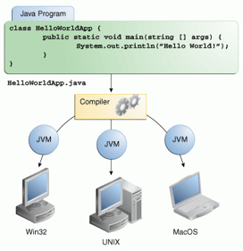
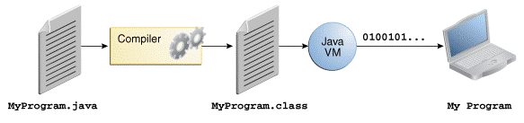

# Java Development Kit (JDK)

The Java Development Kit (JDK) is a software development environment used for 
developing Java applications. It includes the **Java Runtime Environment (JRE)**, 
an **interpreter/loader (Java)**, a **compiler (javac)**, an **archiver (jar)**, a 
**documentation generator (Javadoc)**, and other tools needed for Java development.

## Setup

Installing a JDK is as easy as downloading and unzipping a file.

The `PATH` environment variable must point to the `bin/` folder of the JDK.
In addition, you should set a `JAVA_HOME` environment variable.

### Windows

```
    URL: https://jdk.java.net/java-se-ri/17
    Download: openjdk-17+35_windows-x64_bin.zip
    Unzip and move to: C:\local\jdk-17 
    Set: JAVA_HOME=C:\local\jdk-17
    Add to PATH:  C:\local\jdk-17\bin

    >javac -version
    javac 17
```

### Linux 

```
    URL: https://jdk.java.net/java-se-ri/17
    Download: openjdk-17+35_linux-x64_bin.tar.gz
    $ tar xvzf openjdk-17+35_linux-x64_bin.tar.gz
    $ sudo mkdir /opt/java
    $ sudo mv jdk-17/ /opt/java/

    Set: JAVA_HOME=/opt/java/jdk-17
    Add to PATH: $JAVA_HOME/bin

    $ javac -version
    javac 17
```


### JDK Roadmap 

For product releases after Java SE 8, Oracle will designate only certain
releases as **Long-Term-Support (LTS)** releases. Java SE 8, 11, 17 
and 21 are LTS releases. 
Oracle intends to make future **LTS releases every two years** meaning 
the next planned LTS release is Java 25 in September 2025.

```
Java SE 8 (LTS)     2014    March	
Java SE 9           2017    September 	
Java SE 10          2018    March 		
Java SE 11 (LTS)    2018    September 
Java SE 12          2019    March 	
Java SE 13          2019    September
Java SE 14          2020    March
Java SE 15          2020    September
Java SE 16          2021    March
Java SE 17 (LTS)    2021    September
Java SE 18          2022    March
Java SE 19          2022    September 
Java SE 20          2023    March 
Java SE 21 (LTS)    2023    September
Java SE 22          2024    March 
Java SE 23          2024    September 
Java SE 24          2025    March 
Java SE 25 (LTS)    2025    September 
...
```

### OpenJDK vs. Oracle JDK 

OpenJDK is a free and open-source implementation of the Java SE Platform Edition.

Oracle provides long term support for its releases. On the other hand, 
OpenJDK only supports the changes to a release until the next version is released.

**Oracle JDK was licensed under the Oracle Binary Code License Agreement**,
whereas **OpenJDK** has the **GNU General Public License (GNU GPL) version 2** 
with a linking exception.


## Java Programming Language

The Java programming language was originally designed for use in embedded 
consumer-electronic applications by **James Gosling**. Java was first released in **1995**

Java is a general-purpose, concurrent, class-based, **object-oriented programming language**, 
designed to have as few implementation dependencies as possible. 




### Bytecode

Java source code is first written in plain text files ending with the **.java** extension.

Those source files are then compiled into **.class** files by the javac compiler. 
A `.class` file contains **bytecodes**, the machine language of the **Java Virtual Machine (JVM)**. 




### Java Archive File (JAR)

In the context of Java, the concept of a Java Archive (JAR) file is central to packaging, 
distributing, and using Java applications and libraries. JAR is a file format based on 
the popular **ZIP file format**. 

A JAR file contains a **collection of Java classes, metadata, and resources** (such as text, 
images, and configuration files) associated with these classes. It allows developers to 
efficiently distribute their applications or libraries in a single file.

A crucial part of a JAR file is its **manifest file** `MANIFEST.MF`, located in the 
`META-INF` directory. The manifest contains special metadata about the JAR file, such 
as its version, the main class with the `public static void main(String[] args)` method, 
and package sealing and signing information.

_Example_: List the content of a JAR file
```
$ jar tf file.jar
```

To display the content of a JAR file without extracting it, we can use the **jar tool** 
included with the JDK.


## References

* [DevJava: Getting Started with Java](https://dev.java/learn/getting-started/)

* JDK
    * [OpenJDK](https://jdk.java.net/java-se-ri/17)
    * [JDK 17 Documentation](https://docs.oracle.com/en/java/javase/17/)
    * [Baeldung: Differences Between Oracle JDK and OpenJDK](https://www.baeldung.com/oracle-jdk-vs-openjdk)

* Java Programming 
    * [The Java™ Tutorials: Getting Started](https://docs.oracle.com/javase/tutorial/getStarted/index.html)
    * [The Java® Language Specification](https://docs.oracle.com/javase/specs/jls/se21/html/index.html)
    * [Java® Platform, Standard Edition & Java Development Kit
Version 21 API Specification](https://docs.oracle.com/en/java/javase/21/docs/api/index.html)


*Egon Teiniker, 2024, GPL v3.0*
