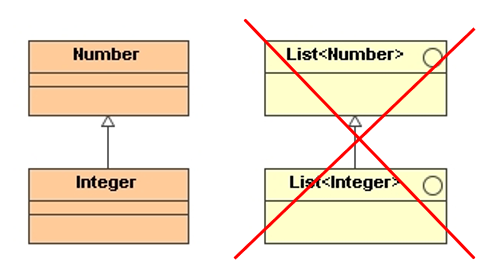
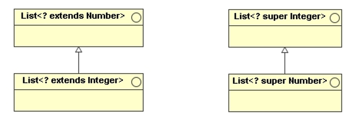

# Java Generics

> Generics enable types (classes and interfaces) to be parameters when defining classes, 
> interfaces and methods. Much like the more familiar formal parameters used in method 
> declarations, type parameters provide a way for you to **reuse the same code with different inputs**. 
> The difference is that the inputs to formal parameters are values, while the inputs to 
> type parameters are types.

Code that uses generics has many **benefits** over non-generic code:

* **Stronger type checks at compile time**: A Java compiler applies strong type checking 
    to generic code and issues errors if the code violates type safety. Fixing compile-time 
    errors is easier than fixing runtime errors, which can be difficult to find.

* **Elimination of casts**:

    The following code snippet without generics requires casting:
    ```Java
    List list = new ArrayList();
    list.add("hello");
    String s = (String) list.get(0);
    ```

    When re-written to use generics, the code does not require casting:
    ```Java
    List<String> list = new ArrayList<String>();
    list.add("hello");
    String s = list.get(0);   // no cast !!!
    ```

* **Enabling programmers to implement generic algorithm**s:
    By using generics, programmers can implement generic algorithms that work 
    on collections of different types, can be customized, and are type safe 
    and easier to read.


## Generic Types 

> A generic type is a generic class or interface that is parameterized over types.

A generic class is defined with the following format:
```Java
class name<T1, T2, ..., Tn> 
{ 
    //...  
}
```

The **type parameter** section, delimited by angle brackets (`<` and `>`), follows 
the class name. It specifies the type parameters (also called type variables) 
`T1`, `T2`, ..., and `Tn`.

_Example_: Generic Tuple class
```Java
public final class Tuple<F,S>
{
    public GenericTuple(F a, S b)
    {
        if(a == null || b == null)
            throw new IllegalArgumentException();
        this.a = a;
        this.b = b;
    }

    private final F a;
    public F getFirstElement()
    {
        return a;
    }
    
    private final S b;
    public S getSecondElement()
    {
        return b;
    }
}
```

**A type variable can be any non-primitive type** we specify: any class type, 
any interface type, any array type, or even another type variable.

By convention, type parameter names are **single, uppercase letters**. 

This same technique can be applied to create **generic interfaces**.

To reference the generic class from within our code, we must perform 
a **generic type invocation**, which replaces `T` with some concrete value

_Example_: Using the generic Tuple class
```Java
    @Test
    public void testGetters()
    {
        Tuple<Integer,String> t = new Tuple<>(7, "Teini");
        
        Assert.assertEquals(Integer.valueOf(7), t.getFirstElement());
        Assert.assertEquals("Teini", t.getSecondElement());
    }
```

An invocation of a generic type is generally known as a **parameterized type**.

In Java SE 7 and later, we can replace the type arguments required to invoke 
the constructor of a generic class with an empty set of type arguments `<>` as 
long as the compiler can determine, or infer, the type arguments from the context. 
This pair of angle brackets, `<>`, is informally called the **diamond**.


### Raw Types 

A raw type is the name of a generic class or interface **without any type arguments**. 

Raw types show up in **legacy code** because lots of API classes (such as the Collections 
classes) were not generic prior to JDK 5.0. 

When using raw types, we essentially get pre-generics behavior — a `Tuple` gives us Objects. 


### Type Erasure

Generics were introduced to the Java language to provide tighter type checks at 
compile time and to support generic programming. 

To implement generics, the **Java compiler applies type erasure** to:

* Replace all type parameters in generic types with their bounds or `Object` if the 
    type parameters are unbounded. The produced bytecode, therefore, contains only 
    ordinary classes, interfaces, and methods.
* Insert type casts if necessary to preserve type safety.
* Generate bridge methods to preserve polymorphism in extended generic types.

Type erasure ensures that no new classes are created for parameterized types; consequently,
generics incur **no runtime overhead**.


## Generic Methods

> Generic methods are methods that introduce their own type parameters. 

This is similar to declaring a generic type, but the **type parameter's scope 
is limited to the method** where it is declared. Static and non-static generic 
methods are allowed, as well as generic class constructors.

_Example:_ Generic method (inside of a regular class)
```Java
public class ListUtils
{    
    public static <T> List<T> asList(T... in)
    {
        List<T> out = new ArrayList<T>();        
        for(T t : in)
        {
            out.add(t);
        }        
        return out;
    }
    //...
}
```

This method accepts an array of type `T[]` and returns a list of type `List<T>`,
and does so for any type `T`.

This is indicated by writing `<T>` at the beginning of the method signature,
which declares `T` as a new type variable.

The scope of the type variable `T` is local to the method itself.


_Example:_ Using generic methods 
```Java
	@Test
	public void testStringArrayToList()
    {
        List<String> list = ListUtils.asList("one", "two", "three", "4");
        assertEquals("[one, two, three, 4]", list.toString());
    }
```
Generally, the explicitly type (`ListUtils.<String>asList()`) can be left out and 
the compiler will infer the type that is needed - known as **type inference**.
This allows us to invoke a generic method as an ordinary method, without specifying a 
type between angle brackets. 


## Bounded Type Parameters

Bounded type parameters in Java generics are a way to **restrict the types** that 
can be used as arguments for type parameters. 

By specifying bounds for type parameters, we can enforce that the actual type arguments 
passed to a generic class, interface, or method must be **subclasses of a particular class** 
or **implement a particular interface**. 

This adds a **layer of type safety** and allows for more specific method implementations 
that rely on the methods of the bound class or interface.

Bounded type parameters are declared using the **extends** keyword in the type parameter 
declaration. Despite the use of extends, the bound can be either a class or an interface.

_Example:_ DAOTemplate excepts only `Entity` or `Entity` subclasses as type arguments.   
```Java
public interface DAOTemplate<E extends Entity>
{
	E insert(E user);
	E update(E user);
	void delete(E user);
	E findById(int id);
	List<E> findAll();
}
```

To ensure that the `DAOTemplate` interface only uses `E` of type `Entity` or its 
subclasses, we can add a type bound to the generic type `E`. This is done by 
specifying **E extends Entity** in the interface definition.


## Subtyping and Wildcards

In Java generics, **wildcards** are **special kind of type arguments** that allow 
for more flexible method parameters, return types, and field types. 
They are denoted by the question mark **?** symbol. 

Wildcards are particularly useful in situations where you have code that can work 
with a **class hierarchy**. There are three main kinds of wildcards in Java: 
unbounded wildcards, upper bounded wildcards, and lower bounded wildcards.

* **Unbounded Wildcards**: An unbounded wildcard is specified using **?**, and it 
    **represents any type**. It's most useful when you write a method that doesn't 
    really depend on the type parameter. 

* **Upper Bounded Wildcards**: Upper bounded wildcards are denoted by **? extends Type**, 
    meaning the **unknown type is a subtype of Type, including Type itself**. This is used 
    when you want to restrict a generic type to a certain family of classes. 
    
    _Example:_ Upper bounded wildcards   
    ```Java
    public static double sum(List<? extends Number> numbers)
    {
        double sum = 0.0;
        for(Number n : numbers)
        {
            sum += n.doubleValue();
        }
        return sum;
    }
    ```

    This method takes a collection of numbers, converts each to a double,
    and sums them up.
     
    Whenever we use an iterator, we **get values** out of a data structure,
    so we use a **<? extends T>** wildcard.
    
    `<? extends T>` means that the source list may have elements of any type that
    is a subtype of `T`.
     
    Since we use `? extends Number`, all of the following parameters are legal:
    `List<Integer>`, `List<Double>`, `List<Number>`, etc.


* **Lower Bounded Wildcards**: Lower bounded wildcards are specified using **? super Type**, 
    which means the **unknown type is a supertype of Type, including Type itself**. 
    This is useful when you need to write a method that puts objects into a collection. 

    _Example:_ Lower bounded wildcards   
    ```Java
    public static void fill(List<? super Integer> list, int n)
    {
        for(int i = 0; i<n; i++)
        {
            list.add(i);
        }
    }
    ```
    
    This method takes a list of numbers and an integer `n`, and puts the first `n`
    integers, starting from zero, into the list.

    Whenever we use the `add()` method, we **put values** into a data structure, so we 
    use a **<? super T>** wildcard.

    Since we use `<? super Integer`, all of the following parameters are legal:
    `List<Integer>`, `List<Number>`, `List<Object>`.


The problem is that even though `Integer` is a subtype of `Number`, 
`List<Integer>` is not a subtype of `List<Number>` (contrast this with arrays, 
where `Integer[]` is a subtype of `Number[]`).

* `List<? extends T>` means that the list may have elements of any type that is a subtype of `T`.
* `List<? super T>` means that the list may have elements of any type that is a supertype of `T`.



* Non-wildcard parameterized types are subtypes of suitable bounded, wildcard parameterized types.
* `List<?>` is not another way of saying `List<Object>`, rather, it is a way of saying 
    `List<? extends Object>`.



> **Get and Put Principle**: Use an `extends` wildcard when you only get values out of 
> a structure, use a `super` wildcard when you only put values into a structure, and don‘t 
> use a wildcard when you both get and put.

_Example:_ Reading data from and writing data to a data structure   
```Java
    public static <T> void copy(List<? extends T> src, List<? super T> dest)
    {
        for(int i = 0; i<src.size(); i++)
        {
            dest.add(src.get(i));
        }
    }
```

By using wildcards, developers can design APIs that are flexible and adaptable, 
making it easier to work with complex class hierarchies and collections of various types.


## References

* [YouTube: Generics In Java - Full Simple Tutorial](https://youtu.be/K1iu1kXkVoA?si=5UQ7fRTocWzbC8vi)

* [DevJava: Generics](https://dev.java/learn/generics/)

* [Baeldung: The Basics of Java Generics](https://www.baeldung.com/java-generics)

* Maurice Naftalin, Philip Wadler. **Java Generics and Collections**. O‘Reilly, 2006.


*Egon Teiniker, 2024, GPL v3.0*
